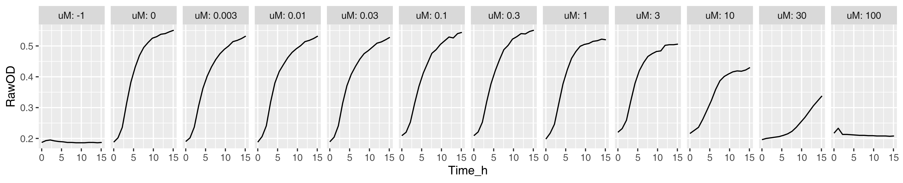
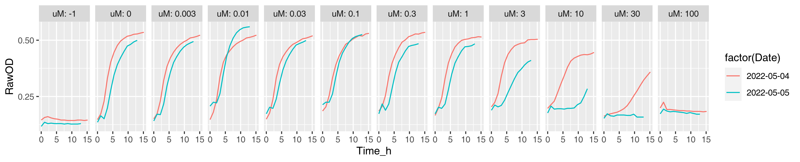
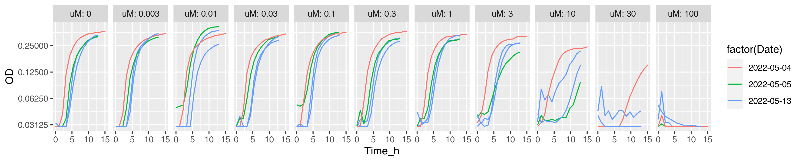
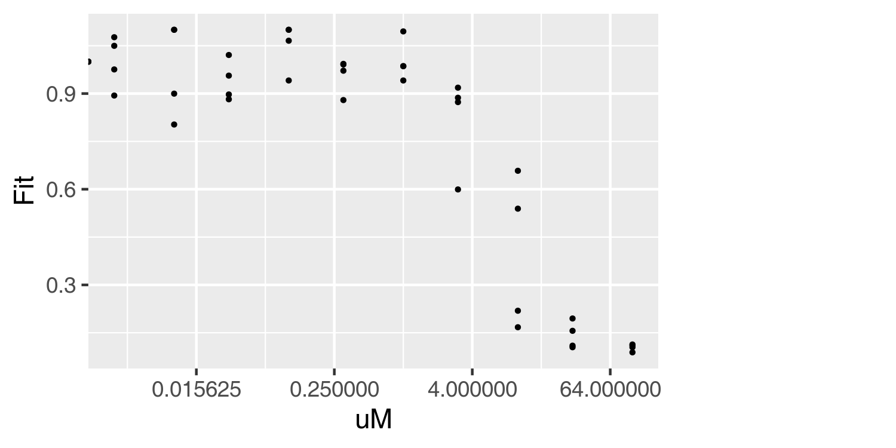
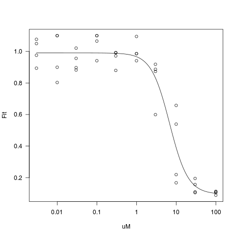

# Motivation

Getting up to speed with R using dose-response for 32 drugs against
6 bacterial strains. It assumes familiarity with `R` in general and `ggplot2`
in particular. I recommend introductory courses from
[DataCamp](https://www.datacamp.com/data-courses/r-courses) or
[Coursera](https://www.coursera.org/learn/r-programming).


```{r setup, include=FALSE}
knitr::opts_chunk$set(echo=FALSE, warning=FALSE, message=FALSE, dpi=300)
knitr::opts_knit$set(global.par = TRUE)
library('tidyverse')
```

# Tasks

In the following, we go through the most common steps in data analysis:
exploration, transformation (i.e. deriving new variables) and modeling.
Integral to all steps is visualization i.e. making graphs. 

## Explore

As a first look, the exploratory plots are informative and serve as a quality
control i.e. you check that there is nothing extra suspicious going on. Raw OD will suffice for that.

1. Plot growth curves following raw OD in time. Input
   [data](doc/tasks/01_dat.csv) is provided and expected output plot is shown below. The data is for azithromycin against _S. flexneri_ M90T
   from day 2022-05-04 (first replicate). _A tip: Use `facet_wrap` with `nrow = 1` argument to have different concentrations on separate plots._

   

2. Try again, now with [data](doc/tasks/02_dat.csv) from two days (let us plot
   days in different color). In addition, transform the y-axis to logarithmic
   scale. Expected output is shown below. _A tip: you need to turn
   the `Date` variable into a factor._

   

3. Once more, now with [data](doc/tasks/03_dat.csv) from three days. You will
   encounter an issue because there were two biological replicates on third
   day. There are multiple ways to overcome this. I recommend to
   solve it via `group` parameter of `aes` e.g. 
   `ggplot(aes(..., group = Plt))`.

   

## Transform

To quantify the growth (either rate or yield) one needs to subtract the
background from raw OD. There are two ways to do that: 1) using a readout from
just the medium; 2) using the smallest value per well (i.e. OD in one of the
first timepoints of a particular well). I prefer to use the former whenever
possible.

4. Add an `OD` variable to your dataframe for background subtracted OD. You
   need two things: 1) to `group` the data and 2) a way to point to background
   wells. Since grouping takes a bit practice until it becomes easy, I will
   just say that you need to subtract background on each day, on each plate,
   in each timepoint. The wells with no bacteria were encoded to have `uM = -1` i.e. after appropriate grouping it comes down to: `OD = OD - OD[uM == -1]`. Input [data](doc/tasks/03_dat.csv) is the same as in step 3 above.
   Finally, plot the result exactly as in step 3 above, except have OD on y-axis. I choose also to drop the background control (`uM == -1`).

   

5. Constrain the OD at limit of detection. You might notice on the
   previous plot that some of the growth curves start at very low values. In
   fact, some of the ODs ended up negative. This is because the values are
   actually lower bound by limit of detection (LOD). Experience tells that at
   OD~595~ with 30 µL/well in LB, the limit of detection is ~0.03. So the
   final step for deriving background subtracted ODs is to constrain OD at
   0.03. Multiple ways are again possible, I would go for `ifelse` statement.
   Finally, plot the result as you did above.

   

6. Add a `Fit` variable to your dataframe for fitness. OD is a fine measure and much can be learned staring at growth curves [[ref](https://www.annualreviews.org/doi/abs/10.1146/annurev.mi.03.100149.002103)].
   But we're interested in the effect of the drug i.e. how much
   better/worse do bacteria grow upon treatment. To that end, use the same
   grouping as for OD (on each day, on each plate, in each timepoint) and
   derive fitness as `OD = OD/OD[uM == 0]`. Please also  constrain `Fit` to
   1.1 (just for making plots look nicer). Finally, plot the result as in the
   step above, except have `Fit` on y-axis.

    


## Model

The distinction between transforming and modeling is a subtle one, arbitrary
really. Modeling usually entails slightly more sophisticated transformations
to summarize data and to ask questions e.g. 'is this different from that'.

Looking at above plot, it seems that about 8-10h would be a good time to
score the effect of a drug (fitness is maximally affected there for
concentrations/replicates). Let's check the closest timepoints to 10h:
 
```{r echo=T}
dat = read.csv('doc/tasks/03_dat.csv')
filter(dat, Time_h > 9.5, Time_h < 10.5) %>%
   count(Time_h)
```

Good, filtering for `Time_h` between 9.5 and 10.5 h gives a desired result.

7. Let us plot the dose-response curve. Dose-response curves are sigmoidal only
   if the dose axis is multiplicative i.e. logarithmic, so let us do that.
    
   {width=60%}


8. Now we fit a curve to this data. We have to use some equation that describes
   the curve which is clearly not linear. We cannot avoid a little bit
   background here. Looks more complicated than it is, please read about:

   - The basics of a four parameter logistic regression [4PL](doc/4pl.md)
   - [Formula interface](doc/formulaR.md), a very powerful and indispensable
     tool for modelling in R.
   - Introduction to [drc](doc/drc.md) package, a dedicated package for
     DoseResponseCurves that allows one to fit them in no time.
  
   After all this reading, one must be hyngry for data analysis. Load `drc` library and see if you can make the plot below. There is one issue though: `drm` does not know how to handle `uM = -1` --  not a real concentration anyways, encoding we used for background control --  so get rid of that before fitting.
    
   {width=60%}

9. Finally. Let us propose the MIC is the concentration at which the
   azithromycin excerts 95% effect. Can you calculate that with confidence
   intervals?

10. There is one more thing. An intricacy. We have fitted and plotted (i.e.
    think about) the `x`, the concentration, in logarithmic scale, but the
    IC~50~ is in linear scale. Mostly, it does not matter much. You can see
    above, however, that the lower confidence interval is 5x lower than IC~95~
    and the upper limit is less than 2x higher. One side is 5x away, the other
    less than 2x. To fix that, one could estimate IC~50~ in log scale
    (substitute IC~50~ in the 4-parameter logistic regression with
    log(IC~50~)). One might have to take some time to think about it what that means. Luckily, `drm` makes all this easy. You fit the model exactly as
    you did before, but this time, set `fct` to `LL2.4()`. Finally, when
    calculating MIC, the confidence interval should be set to "fls" 
    (`interval = "fls"`). 

    Now the MIC (IC~95~) should be the same you got with `LL.4` (33 µM), but
    the confidence intervals are symmetric, about 2x lower and 2x higher.

# Growth rates

Some people are strong affectionados of growth-rate based estimation of drug
effect. So you might have an inclination/motivation to do just that. There are
two ways to go about it: 1) estimate the slope from a log transformed growth
curve; 2) apply a specific growth model.

Background knowledge needed to proceed:

- [Formula interface](doc/formulaR.md), which we visited already above
- [Introduction to growthrates](doc/growthrates.md) package
