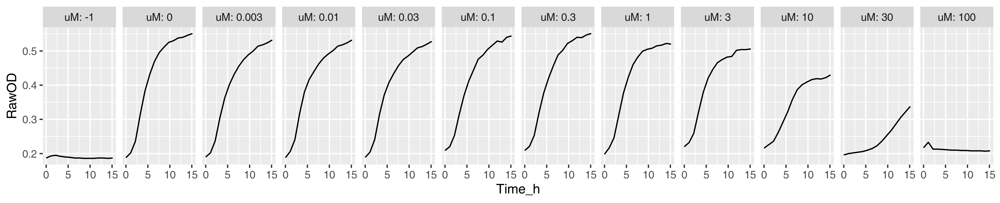
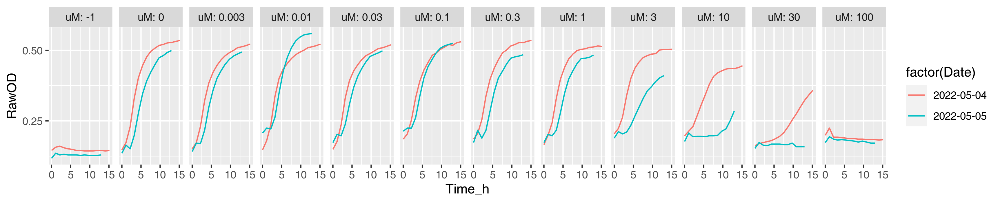
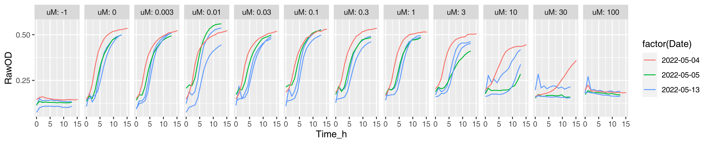
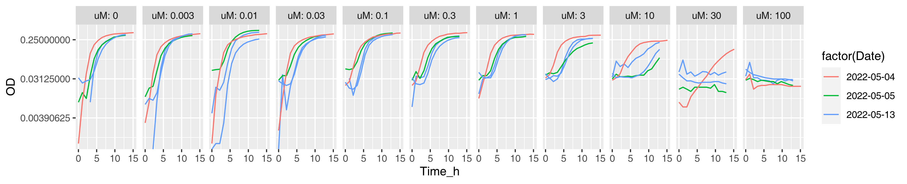
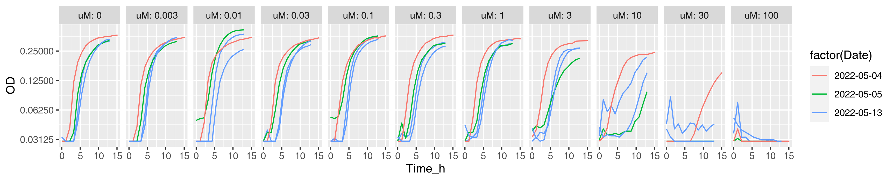
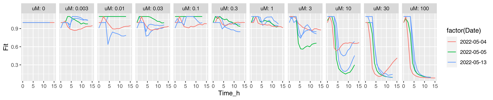
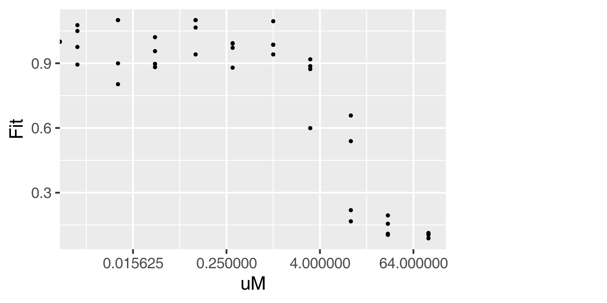

# Motivation

Getting up to speed with R using dose-response for 32 drugs against 6
bacterial strains.

# Tasks

In the following, we go through the most common steps in data analysis:
exploration, transformation (i.e. deriving new variables) and modeling.
Integral to all steps is visualization i.e. making graphs.

## Explore

As a first look, the exploratory plots are informative and serve as a
quality control i.e. you check that there is nothing extra suspicious
going on. Raw OD will suffice for that.

1.  Plot growth curves following raw OD in time. Input
    [data](doc/tasks/01_dat.csv) is provided and expected output plot is
    shown below. The data is for azithromycin against *S. flexneri* M90T
    from day 2022-05-04 (first replicate). *A tip: Use `facet_wrap` with
    `nrow = 1` argument to have different concentrations on separate
    plots.*

    

2.  Try again, now with [data](doc/tasks/02_dat.csv) from two days (let
    us plot days in different color). In addition, transform the y-axis
    to logarithmic scale. Expected output is shown below. *A tip: you
    need to turn the `Date` variable into a factor.*

    

3.  Once more, now with [data](doc/tasks/03_dat.csv) from three days.
    You will encounter an issue because there were two biological
    replicates on third day. There are multiple ways to overcome this. I
    recommend to solve it via `group` parameter of `aes` e.g. 
    `ggplot(aes(..., group = Plt))`.

    

## Transform

To quantify the growth (either rate or yield) one needs to subtract the
background from raw OD. There are two ways to do that: 1) using a
readout from just the medium; 2) using the smallest value per well
(i.e. OD in one of the first timepoints of a particular well). I prefer
to use the former whenever possible.

1.  Add an `OD` variable to your dataframe for background subtracted OD.
    You need two things: 1) to `group` the data and 2) a way to point to
    background wells. Since grouping takes a bit practice until it
    becomes easy, I will just say that you need to subtract background
    on each day, on each plate, in each timepoint. The wells with no
    bacteria were encoded to have `uM = -1` i.e. after appropriate
    grouping it comes down to: `OD = OD/OD[uM == -1]`. Input
    [data](doc/tasks/03_dat.csv) is the same as in step 3 above.
    Finally, plot the result exactly as in step 3 above, except have OD
    on y-axis. I choose also to drop the background control
    (`uM == -1`).

    

2.  Constrain the OD at limit of detection. You might notice on the
    previous plot that some of the growth curves start at very low
    values. In fact, some of the ODs ended up negative. This is because
    the values are actually lower bound by limit of detection (LOD).
    Experience tells that at OD595 with 30 µL/well in LB, the
    limit of detection is ~0.03. So the final step for deriving
    background subtracted ODs is to constrain OD at 0.03. Multiple ways
    are again possible, I would go for `ifelse` statement. Finally, plot
    the result as you did above.

    

3.  Add a `Fit` variable to your dataframe for fitness. OD is a fine
    measure and much can be learned staring at growth curves
    \[[ref](https://www.annualreviews.org/doi/abs/10.1146/annurev.mi.03.100149.002103)\].
    But we’re interested in the effect of the drug i.e. how much
    better/worse do bacteria grow upon treatment. To that end, use the
    same grouping as for OD (on each day, on each plate, in each
    timepoint) and derive fitness as `OD = OD/OD[uM == 0]`. Please also
    constrain `Fit` to 1.1 (just for making plots look nicer). Finally,
    plot the result as in the step above, except have `Fit` on y-axis.

    

## Model

The distinction between transforming and modeling is a subtle one,
arbitrary really. Modeling usually entails slightly more sophisticated
transformations to summarize data and to ask questions e.g. ‘is this
different from that’.

Looking at above plot, it seems that about 8-10h would be a good time to
score the effect of a drug (fitness is maximally affected there for
concentrations/replicates). Let’s check the closest timepoints to 10h:

    filter(dat, Time_h < 10.5, Time_h > 9.5) %>%
       count(Time_h)

    ## # A tibble: 4 × 4
    ## # Groups:   Date, Plt, Time_h [4]
    ##   Date         Plt Time_h     n
    ##   <date>     <dbl>  <dbl> <int>
    ## 1 2022-05-04     4   9.73    12
    ## 2 2022-05-05     2   9.73    12
    ## 3 2022-05-13     1   9.73    12
    ## 4 2022-05-13     6   9.74    12

Good, filtering for `Time_h` between 9.5 and 10.5 h gives a desired
result.

1.  Let us plot the dose-response curve. Dose-response curves are
    sigmoidal only if the dose axis is multiplicative i.e. logarithmic,
    so let us do that.

    

2.  Now we fit a curve to this data. We use some equation that describes
    the curve which is clearly not linear. We cannot avoid a little bit
    theory/math here. Looks more complicated than it is, read about the
    basics of a four parameter logistic regression [4PL](doc/4pl.md) and
    come back.
