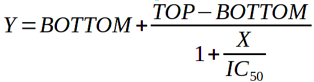
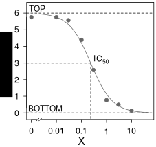

# Four parameter logistic regression

For sigmoidal (S-shaped) curves, equation that does a good job at describing them is
called `four parameter logistic regression` (sometimes called Hill
equation). Do not worry at this point, what logistic means or who is Hill.
As the name of equation implies, it has 4 parameters that need to be
estimated in order to "fit the curve". This equation can be written in many
forms, I find this one most instructive: 

{width=40%}

For now, it has just 3 parameters: _TOP_ and _BOTTOM_ correspond to maximum and
minimum of the curve on _Y_ axis and _IC~50~_ is _X_ that corresponds to middle
point in half way from _TOP_ to _BOTTOM._ In our case, _Y_ is fitness and _X_
is the concentration of azithromycin. It is easiest to see all this on a
figure:

{width=30%}

Here, the _TOP_ is 6, _BOTTOM_ is 0 and _IC~50~_ (correspoinding to Y = 3) is about 0.2.

For an intuition how the equation works, imagine three scenarios: 

1. _X_ is very small compared to _IC~50~_. Denominator becomes 1 + 0. _Y =
   BOTTOM + TOP - BOTTOM_. Thus, _Y = TOP_

2. _X_ is very big compared to _IC~50~_. Denominator becomes 1 + `inf` and _Y = BOTTOM + 0_. Thus, _Y = BOTTOM_

3. _X_ = _IC~50~_. Denominator becomes 1 + 1 and _Y = BOTTOM + (TOP - BOTTOM)/2_. Thus, _Y_ = bottom plus half way from bottom to top.

Now, there's only one final thing left. I promised four parameters. Well, the fourth one was hidden:

{width=40%}

The fourth and final parameter is _SLOPE_. It was fair to hide this,
because when _SLOPE_ = 1 we end up equation above with just three
parameters. _SLOPE_ is the familiar slope from linear regression i.e. it
tells how fast the Y, opon change in X, goes from _TOP_ to _BOTTOM_. Some
people call _SLOPE_ `Hill coefficient`. _SLOPE_ is exactly what the name
implies, graphically it corresponds to a straight line for the linear part
in the centre of sigmoidal curve:

{width=30%}
