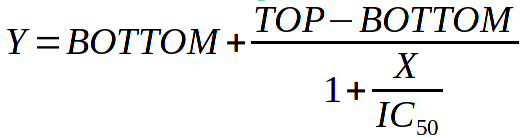
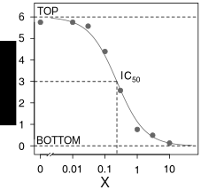
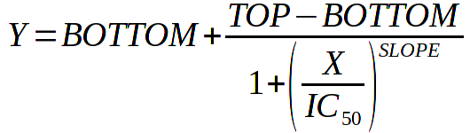
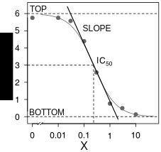

# Four parameter logistic regression

For sigmoidal (S-shaped) curves, equation that does a good job at
describing them is called `four parameter logistic regression`
(sometimes called Hill equation). Do not worry at this point, what
logistic means or who is Hill. As the name of equation implies, it has 4
parameters that need to be estimated in order to “fit the curve”. This
equation can be written in many forms, I find this one most instructive:

For now, it has just 3 parameters: *TOP* and *BOTTOM* correspond to
maximum and minimum of the curve on *Y* axis and *IC50* is
*X* that corresponds to middle point in half way from *TOP* to *BOTTOM.*
In our case, *Y* is fitness and *X* is the concentration of
azithromycin. It is easiest to see all this on a figure:

Here, the *TOP* is 6, *BOTTOM* is 0 and *IC50*
(correspoinding to Y = 3) is about 0.2.

For an intuition how the equation works, imagine three scenarios:

1.  *X* is very small compared to *IC50*. Denominator becomes
    1 + 0. *Y = BOTTOM + TOP - BOTTOM*. Thus, *Y = TOP*

2.  *X* is very big compared to *IC50*. Denominator becomes
    1 + `inf` and *Y = BOTTOM + 0*. Thus, *Y = BOTTOM*

3.  *X* = *IC50*. Denominator becomes 1 + 1 and *Y = BOTTOM +
    (TOP - BOTTOM)/2*. Thus, *Y* = bottom plus half way from bottom to
    top.

Now, there’s only one final thing left. I promised four parameters.
Well, the fourth one was hidden:

The fourth and final parameter is *SLOPE*. It was fair to hide this,
because when *SLOPE* = 1 we end up equation above with just three
parameters. *SLOPE* is the familiar slope from linear regression i.e. it
tells how fast the Y, opon change in X, goes from *TOP* to *BOTTOM*.
Some people call *SLOPE* `Hill coefficient`. *SLOPE* is exactly what the
name implies, graphically it corresponds to a straight line for the
linear part in the centre of sigmoidal curve:

