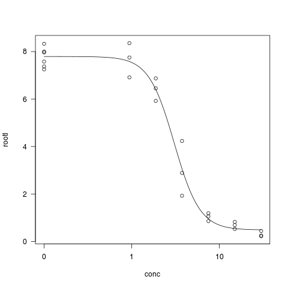

# Get ready

[Drc](http://journals.plos.org/plosone/article?id=10.1371/journal.pone.0146021)
is a package by [Christian Ritz](https://bioassay.dk/) that allows one to fit
dose-response curves in `R` in no time. We're going to scratch the surface here
what the package can do and already this is a lot for our intends and purposes.

```{r}
# load the libraries
library(tidyverse)
library(drc)
```

We will illustrate the use of `drc` with one of its own in-built datasets,
`ryegrass`. It contains a single dose-response curve with two variables:
`rootl` a numeric vector of root lengths, `conc` a numeric vector of
concentrations of a herbicide.

```{r}
str(ryegrass)
?ryegrass
```

The workhorse of the `drc` is function `drm` (Dose-Response Model) and it works pretty similarly to `lm` which we used to fit linear model. The only new thing is `fct` argument. `fct` defines the exact function to be used and some sane initial values for parameters (contrary to linear regression, estimation of parameters in non-linear regression requires some starting estimates of parameter values). For four parameter logistic regression, we need to set `fct = LL.4` (log-logistic with 4 parameters, the extra "log" is just to denote that x-axis is in log scale; e.g. there is also LL.3, three parameter version, this sets slope to be 1).

```{r}
mod = drm(rootl ~ conc, data = ryegrass, fct = LL.4())
```

That is it. Just to make the whole `fct` and `LL.4` thing less intimidating, let us name parameters with names we used before to explain four-parameter logistic regression:

```{r}
mod = drm(rootl ~ conc, data = ryegrass, 
  fct = LL.4(names = c("SLOPE", "BOTTOM", "TOP", "IC50"))
)
plot(mod, type = 'all')
```



We can get a summary of the model parameters using the `summary` function

```{r}
summary(mod)
```

We can calculate the IC~10~ (dose that gives 10% of effect), IC~20~, IC~50~,
IC~90~ etc with the `ED` function.

```{r}
#interval = "delta" gives confidence intervals at a default 95% level.  
ED(mod, c(10,20,50, 90), interval="delta")
```
