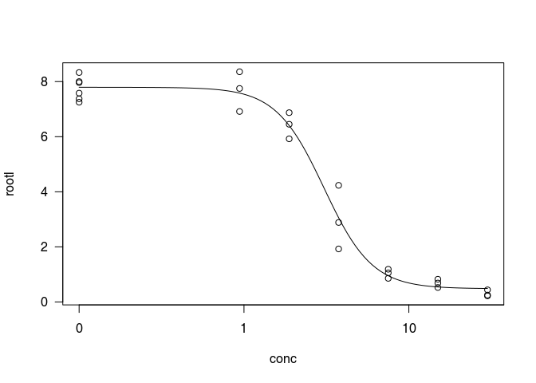

# Get ready

[Drc](http://journals.plos.org/plosone/article?id=10.1371/journal.pone.0146021)
is a package by [Christian Ritz](https://bioassay.dk/) that allows one
to fit dose-response curves in `R` in no time. We’re going to scratch
the surface here what the package can do and already this is a lot for
our intends and purposes.

    # load the libraries
    library(tidyverse)
    library(drc)

We will illustrate the use of `drc` with one of its own in-built
datasets, `ryegrass`. It contains a single dose-response curve with two
variables: `rootl` a numeric vector of root lengths, `conc` a numeric
vector of concentrations of a herbicide.

    str(ryegrass)

    ## 'data.frame':    24 obs. of  2 variables:
    ##  $ rootl: num  7.58 8 8.33 7.25 7.38 ...
    ##  $ conc : num  0 0 0 0 0 0 0.94 0.94 0.94 1.88 ...

    ?ryegrass

The workhorse of the `drc` is function `drm` (Dose-Response Model) and
it works pretty similarly to `lm` which we used to fit linear model. The
only new thing is `fct` argument. `fct` defines the exact function to be
used and some sane initial values for parameters. For four parameter
logistic regression, we need to set `fct = LL.4` (log-logistic with 4
parameters, the extra “log” is just to denote that x-axis is in log
scale; there is alos LL.3 for instance, this sets slope to be 1).

    mod = drm(rootl ~ conc, data = ryegrass, fct = LL.4())

That is it. Just to make the whole `fct` and `LL.4` thing less
intimidating, let us name parameters with names we used before to
explain four-parameter logistic regression:

    mod = drm(rootl ~ conc, data = ryegrass, 
      fct = LL.4(names = c("SLOPE", "BOTTOM", "TOP", "IC50"))
    )
    plot(mod, type = 'all')

We can get a summary of the model parameters using the `summary`
function and calculate the IC10 (dose that gives 10% of
effect), IC20, IC50, IC90 etc with the
`ED` function.

    summary(mod)

    ## 
    ## Model fitted: Log-logistic (ED50 as parameter) (4 parms)
    ## 
    ## Parameter estimates:
    ## 
    ##                    Estimate Std. Error t-value   p-value    
    ## SLOPE:(Intercept)   2.98222    0.46506  6.4125 2.960e-06 ***
    ## BOTTOM:(Intercept)  0.48141    0.21219  2.2688   0.03451 *  
    ## TOP:(Intercept)     7.79296    0.18857 41.3272 < 2.2e-16 ***
    ## IC50:(Intercept)    3.05795    0.18573 16.4644 4.268e-13 ***
    ## ---
    ## Signif. codes:  0 '***' 0.001 '**' 0.01 '*' 0.05 '.' 0.1 ' ' 1
    ## 
    ## Residual standard error:
    ## 
    ##  0.5196256 (20 degrees of freedom)

    #interval = "delta" gives confidence intervals at a default 95% level.  
    ED(mod, c(10,20,50, 90), interval="delta")

    ## 
    ## Estimated effective doses
    ## 
    ##        Estimate Std. Error   Lower   Upper
    ## e:1:10  1.46371    0.18677 1.07411 1.85330
    ## e:1:20  1.92109    0.17774 1.55032 2.29186
    ## e:1:50  3.05795    0.18573 2.67053 3.44538
    ## e:1:90  6.38864    0.84510 4.62580 8.15148
